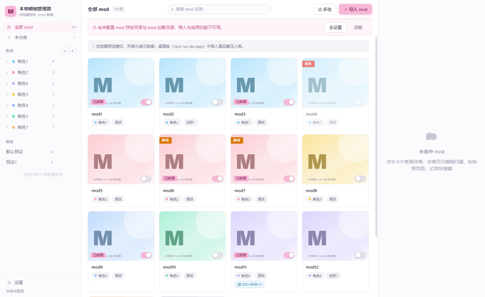
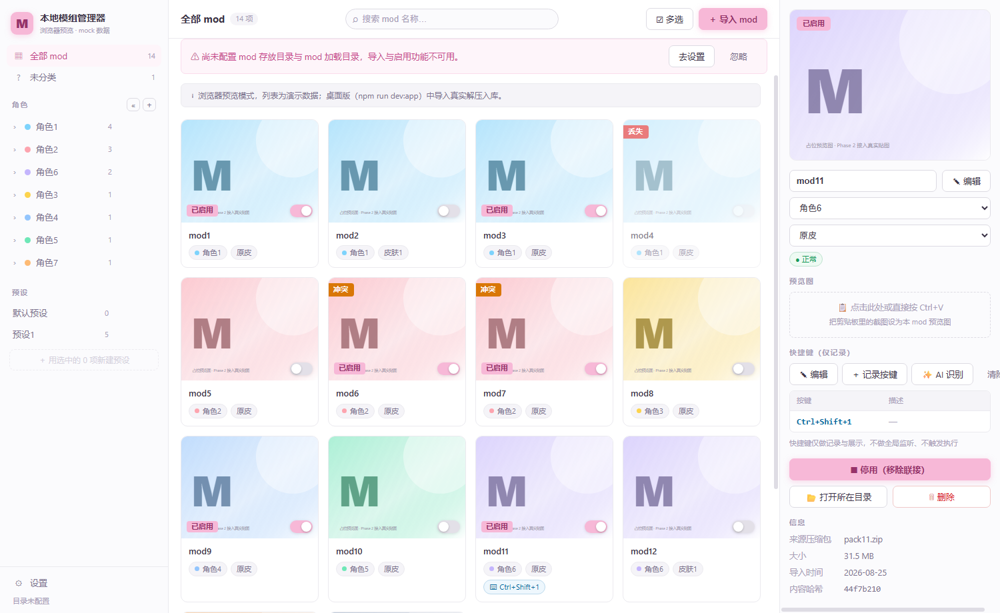

# 本地模组管理器

二游模组的本地仓库 + 启用调度器。





> 截图为**虚构演示数据**，仓库内不含任何游戏资源、mod 文件或真实数据。

## 下载使用

从 [Releases](https://github.com/singhzero/local-mod-manager/releases) 下载：

- **Setup**：安装版，带中文安装向导
- **Portable**：免安装版，双击即用

首次启动后，在「设置」里配置两个目录：

1. **mod 存放目录**：你的 mod 仓库（导入的 mod 都放这里）
2. **mod 加载目录**：加载器的 Mods 根目录（启用 = 在这里创建目录联接，停用即移除）

然后就可以：

- 把 mod 压缩包（zip / 7z / rar）拖进窗口导入，选角色（必选）和皮肤（可选）
- 点卡片上的开关启用 / 停用 mod
- 用预设一键切换整组启用集
- 在详情面板看大图、改归属、粘贴预览图、记录快捷键

## 从源码运行

```bash
npm install
npm run dev        # 浏览器预览（虚构演示数据）
npm run dev:app    # 桌面应用
npm run dist       # 打安装包
```

要求 Node.js ≥ 20。技术栈：Electron + Vue 3 + `node:sqlite`。

## 文档

功能细节、AI 快捷键识别、测试、目录结构、许可与免责声明：见 [docs/DETAILS.md](docs/DETAILS.md)。

## 许可

[PolyForm Noncommercial 1.0.0](LICENSE) —— 仅供个人非商业使用，禁止任何商业用途。
